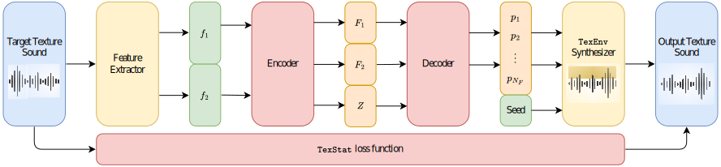

This work introduces three models that can be used for texture sounds analysis and synthesis. These model can work in conjunction but also as pieces of other models. A brief introduction for the three of them can be found here.

2.1. <code>TexStat</code> Loss 📖🚧

<code>TexStat</code> is a loss function based on a direct comparison of a revised version of McDermott and Simoncelli's summary of statistics <a href="https://doi.org/10.1016/j.neuron.2011.06.032" target="_blank" style="font-weight: normal;">[McDermott et al., 2020]</a>. This approach allows the TexStat loss function to train texture sound generative models by focusing strictly on the statistical properties of sounds, rather than the sounds themselves. As a result, the synthesized textures naturally differ from the original inputs, while still preserving the essential perceptual qualities that define their type.

  
  

  <strong>Figure 2.</strong> <code>TexStat</code>'s summary of statistics extraction diagram. 
  
  

2.2. TexEnv Synthesizer 📖🚧

<code>TexEnv</code> is a differentiable signal processor that through the use of the Inverse Discrete Fourier Transform creates a series of cyclic functions that are later imposed as amplitude envelopes of a subband decomposition of white noise. 

  

  <strong>Figure 3.</strong>  <code>TexEnv</code> synthesizer diagram. 
  
  

2.3. TexDSP architecture 📖

<code>TexDSP</code> is an architecture based on Differential Digital Signal Processing (DDSP) <a href="https://magenta.tensorflow.org/ddsp" target="_blank" style="font-weight: normal;">[Engel et al., 2020]</a> introduced as a showcase of the previous models. At its core, <code>TexDSP</code> is a simple neural network whose goal is to learn a way to map simple features to the parameters needed by <code>TexEnv</code> to generate a particular texture sound by means of the <code>TexStat</code> loss function. This is done by finding statistical patterns between amplitude envelopes of a subband decomposition of the training data and then putting all together. A figure that summarizes this architecture can be found below.

  

    
  

  

  <strong>Figure 4.</strong> <code>TexDSP</code> architecture diagram. 
  
  

