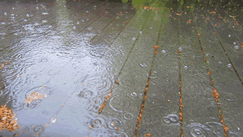
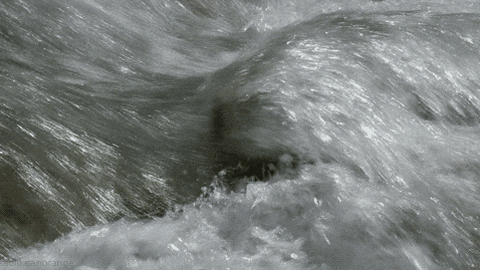
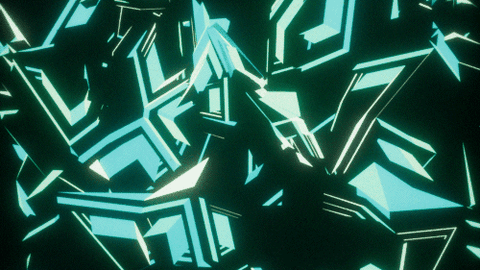

Several experiments were conducted to validate the ideas and models proposed in this work. The details regarding all these experiments can be found here.

<!-- 3.1. TexStat Properties ------------------------------------------------------------------------------------------------------------------------------------------>

3.1. TexStat Properties 📊

Two properties desirable in a loss function tailored for texture sounds are related to the stability under time shifting and addition of noise. In order to test these properties on the <code>TexStat</code> loss function, we compute the loss between a random selection of segments of sounds corresponding to the three categories of <a href="https://huggingface.co/datasets/cordutie/MicroTex" target="_blank" style="font-weight: normal;"><code>MicroTex</code></a> and their corresponding transformations using various parameters. The experiment was also run with the MSS loss for comparison and some of the results can be found in the tables below.

  <table style="width: 100%; border-collapse: collapse; font-size: 0.9em;">
    <thead style="background-color: #f2f2f2;">
      <tr>
        <th style="border: 1px solid #ccc; padding: 8px;">Selection</th>
        <th style="border: 1px solid #ccc; padding: 8px;">Loss</th>
        <th style="border: 1px solid #ccc; padding: 8px;">10%</th>
        <th style="border: 1px solid #ccc; padding: 8px;">30%</th>
        <th style="border: 1px solid #ccc; padding: 8px;">50%</th>
      </tr>
    </thead>
    <tbody>
      <tr><td>BOReilly</td><td><code>TexStat</code></td><td>0.12 ± 0.06</td><td>0.12 ± 0.06</td><td>0.12 ± 0.06</td></tr>
      <tr><td>BOReilly</td><td>MSS</td><td>5.34 ± 1.14</td><td>5.51 ± 1.29</td><td>5.58 ± 1.55</td></tr>
      <tr><td>Freesound</td><td><code>TexStat</code></td><td>0.04 ± 0.03</td><td>0.04 ± 0.03</td><td>0.04 ± 0.03</td></tr>
      <tr><td>Freesound</td><td>MSS</td><td>5.17 ± 1.24</td><td>5.26 ± 1.35</td><td>5.25 ± 1.34</td></tr>
      <tr><td>Syntex</td><td><code>TexStat</code></td><td>0.16 ± 0.11</td><td>0.16 ± 0.11</td><td>0.16 ± 0.11</td></tr>
      <tr><td>Syntex</td><td>MSS</td><td>10.52 ± 7.28</td><td>10.04 ± 6.62</td><td>9.45 ± 6.57</td></tr>
    </tbody>
  </table>
  

  <strong>Table 3.1.</strong> Time-Shift Robustness. Loss measurement between a sound and its time-shifted version. The amount of time shift is given in % of the total signal duration. Computed over 300 one-second sounds randomly sampled from the three main sources in the <code>MicroTex</code> dataset.
  
  

  <table style="width: 100%; border-collapse: collapse; font-size: 0.9em;">
    <thead style="background-color: #f2f2f2;">
      <tr>
        <th style="border: 1px solid #ccc; padding: 8px;">Selection</th>
        <th style="border: 1px solid #ccc; padding: 8px;">Loss</th>
        <th style="border: 1px solid #ccc; padding: 8px;">10%</th>
        <th style="border: 1px solid #ccc; padding: 8px;">30%</th>
        <th style="border: 1px solid #ccc; padding: 8px;">50%</th>
      </tr>
    </thead>
    <tbody>
      <tr><td>BOReilly</td><td><code>TexStat</code></td><td>0.12 ± 0.06</td><td>0.12 ± 0.06</td><td>0.12 ± 0.06</td></tr>
      <tr><td>BOReilly</td><td>MSS</td><td>5.34 ± 1.14</td><td>5.51 ± 1.29</td><td>5.58 ± 1.55</td></tr>
      <tr><td>Freesound</td><td><code>TexStat</code></td><td>0.04 ± 0.03</td><td>0.04 ± 0.03</td><td>0.04 ± 0.03</td></tr>
      <tr><td>Freesound</td><td>MSS</td><td>5.17 ± 1.24</td><td>5.26 ± 1.35</td><td>5.25 ± 1.34</td></tr>
      <tr><td>Syntex</td><td><code>TexStat</code></td><td>0.16 ± 0.11</td><td>0.16 ± 0.11</td><td>0.16 ± 0.11</td></tr>
      <tr><td>Syntex</td><td>MSS</td><td>10.52 ± 7.28</td><td>10.04 ± 6.62</td><td>9.45 ± 6.57</td></tr>
    </tbody>
  </table>
  

  <strong>Table.</strong> Noise-Addition Robustness. Loss measurement between a sound and its noisy version. The amount of noise added is given in % of the signal's energy. Same data sampling as in the previous experiment.
  
  

The results show that <code>TexStat</code> is highly stable with respect to both time shifting and noise addition, adding a penalty only in the category that had sounds that include silence (which generate instability since they have null standard deviance).

<!-- 3.2. TexStat Benchmarks ------------------------------------------------------------------------------------------------------------------------------------------>

3.2. TexStat Benchmarks 📊

To benchmark the computational requirements of <code>TexStat</code>, we evaluated its computation time, gradient descent time, and GPU memory usage. These measurements were conducted multiple times, recording the time taken for loss computation and optimization while tracking memory allocation. The results are presented in Table 3, along with the values for other typical losses.

<table style="width: 100%; border-collapse: collapse; font-size: 0.9em;">
  <thead style="background-color: #f2f2f2;">
    <tr>
      <th style="border: 1px solid #ccc; padding: 8px;">Loss</th>
      <th style="border: 1px solid #ccc; padding: 8px;">Forward pass time (ms)</th>
      <th style="border: 1px solid #ccc; padding: 8px;">Backward pass time (ms)</th>
      <th style="border: 1px solid #ccc; padding: 8px;">Memory usage (MB)</th>
    </tr>
  </thead>
  <tbody>
    <tr>
      <td><code>TexStat</code></td>
      <td>93.5 ± 0.4</td>
      <td>154.6 ± 0.4</td>
      <td>0.84 ± 2.5</td>
    </tr>
    <tr>
      <td>MSS</td>
      <td>3.9 ± 0.3</td>
      <td>8.5 ± 0.3</td>
      <td>0.85 ± 2.6</td>
    </tr>
    <tr>
      <td>MSE</td>
      <td>0.2 ± 0.3</td>
      <td>0.2 ± 0.1</td>
      <td>1.7 ± 5.0</td>
    </tr>
    <tr>
      <td>MAE</td>
      <td>0.1 ± 0.0</td>
      <td>0.2 ± 0.1</td>
      <td>0.8 ± 2.5</td>
    </tr>
  </tbody>
</table>

  <strong>Table 3.2.</strong> Measurements regarding computation time, gradient computation time, and memory usage in batches of 32 signals of size 65,536 (around 1.5s at a sample rate of 44,100 Hz). The losses studied were <code>TexStat</code>, Multi-Scale Spectrogram (MSS), Mean Squared Error (MSE), and Mean Absolute Error (MAE). All measurements were done using CUDA on an RTX 4090 GPU.

The results show that, as expected, the <code>TexStat</code> loss function is slower than other less specific losses, but it uses a similar amount of memory.

<!-- 3.3. Summary Statistics as a Feature Vector----------------------------------------------------------------------------------------------------------------------->

3.3. Summary Statistics as a Feature Vector 📊

To test <code>TexStat</code> summary statistics as a powerful representation suitable for evaluation metrics like FAD, we conducted the following experiment. First, all data in the three selections of the <code>MicroTex</code> dataset were segmented, and both their summary statistics and VGGish embeddings <a href="#ref-vggish">[VGGish]</a> were computed. Then, a downstream classifier (MLP with hidden layers 128 and 64) was trained for each case. A summary of the results is presented in Table 4.

<table style="width: 100%; border-collapse: collapse; font-size: 0.9em;">
  <thead style="background-color: #f2f2f2;">
    <tr>
      <th style="border: 1px solid #ccc; padding: 8px;">Model</th>
      <th style="border: 1px solid #ccc; padding: 8px;">Selection</th>
      <th style="border: 1px solid #ccc; padding: 8px;">Accuracy</th>
      <th style="border: 1px solid #ccc; padding: 8px;">Precision</th>
      <th style="border: 1px solid #ccc; padding: 8px;">Recall</th>
      <th style="border: 1px solid #ccc; padding: 8px;">F1</th>
    </tr>
  </thead>
  <tbody>
    <tr><td><code>TexStat</code></td><td>BOReilly</td><td>0.94</td><td>0.94</td><td>0.94</td><td>0.94</td></tr>
    <tr><td>VGGish</td><td>BOReilly</td><td>0.71</td><td>0.73</td><td>0.71</td><td>0.71</td></tr>
    <tr><td><code>TexStat</code></td><td>Freesound</td><td>0.99</td><td>0.99</td><td>0.99</td><td>0.99</td></tr>
    <tr><td>VGGish</td><td>Freesound</td><td>0.98</td><td>0.99</td><td>0.98</td><td>0.98</td></tr>
    <tr><td><code>TexStat</code></td><td>Syntex</td><td>1.0</td><td>1.0</td><td>1.0</td><td>1.0</td></tr>
    <tr><td>VGGish</td><td>Syntex</td><td>0.95</td><td>0.95</td><td>0.95</td><td>0.94</td></tr>
  </tbody>
</table>

  <strong>Table 3.4.</strong> Lorea.

The results indicate that, in the context of texture sounds, <code>TexStat</code> summary statistics are strictly more informative than general-purpose embeddings like VGGish.

<!-- 3.4. TexEnv Resynthesis------------------------------------------------------------------------------------------------------------------------------------------->

3.4. TexEnv Resynthesis 🎧

Extensive exploration using the <code>TexEnv</code> synthesizer in resynthesis tasks, employing a signal processing-based parameter extractor, was conducted to better understand its behavior and limitations. A summary of sound examples can be found below.

  

  <!-- Header Row -->
  
<strong>Input Texture</strong>

  
NF=16, parameters count=256

  
NF=16, parameters count=512

  
NF=24, parameters count=256

  
NF=24, parameters count=512

  <!-- Bubbles -->
  

    <audio controls style="width: 100%;">
      <source src="./assets/audios/texenv_resynthesis/bubbles_original.mp3" type="audio/mpeg" />
      Your browser does not support the audio element.
    </audio>
  

  

    <audio controls style="width: 100%;">
      <source src="./assets/audios/texenv_resynthesis/bubbles_resynth_N_F_16_param_per_env_256.mp3" type="audio/mpeg" />
      Your browser does not support the audio element.
    </audio>
  

  

    <audio controls style="width: 100%;">
      <source src="./assets/audios/texenv_resynthesis/bubbles_resynth_N_F_16_param_per_env_512.mp3" type="audio/mpeg" />
      Your browser does not support the audio element.
    </audio>
  

  

    <audio controls style="width: 100%;">
      <source src="./assets/audios/texenv_resynthesis/bubbles_resynth_N_F_24_param_per_env_256.mp3" type="audio/mpeg" />
      Your browser does not support the audio element.
    </audio>
  

  

    <audio controls style="width: 100%;">
      <source src="./assets/audios/texenv_resynthesis/bubbles_resynth_N_F_24_param_per_env_512.mp3" type="audio/mpeg" />
      Your browser does not support the audio element.
    </audio>
  

  <!-- Fire -->
  

    <audio controls style="width: 100%;">
      <source src="./assets/audios/texenv_resynthesis/fire_original.mp3" type="audio/mpeg" />
      Your browser does not support the audio element.
    </audio>
  

  

    <audio controls style="width: 100%;">
      <source src="./assets/audios/texenv_resynthesis/fire_resynth_N_F_16_param_per_env_256.mp3" type="audio/mpeg" />
      Your browser does not support the audio element.
    </audio>
  

  

    <audio controls style="width: 100%;">
      <source src="./assets/audios/texenv_resynthesis/fire_resynth_N_F_16_param_per_env_512.mp3" type="audio/mpeg" />
      Your browser does not support the audio element.
    </audio>
  

  

    <audio controls style="width: 100%;">
      <source src="./assets/audios/texenv_resynthesis/fire_resynth_N_F_24_param_per_env_256.mp3" type="audio/mpeg" />
      Your browser does not support the audio element.
    </audio>
  

  

    <audio controls style="width: 100%;">
      <source src="./assets/audios/texenv_resynthesis/fire_resynth_N_F_24_param_per_env_512.mp3" type="audio/mpeg" />
      Your browser does not support the audio element.
    </audio>
  

  <!-- River -->
  

    <audio controls style="width: 100%;">
      <source src="./assets/audios/texenv_resynthesis/water_original.mp3" type="audio/mpeg" />
      Your browser does not support the audio element.
    </audio>
  

  

    <audio controls style="width: 100%;">
      <source src="./assets/audios/texenv_resynthesis/water_resynth_N_F_16_param_per_env_256.mp3" type="audio/mpeg" />
      Your browser does not support the audio element.
    </audio>
  

  

    <audio controls style="width: 100%;">
      <source src="./assets/audios/texenv_resynthesis/water_resynth_N_F_16_param_per_env_512.mp3" type="audio/mpeg" />
      Your browser does not support the audio element.
    </audio>
  

  

    <audio controls style="width: 100%;">
      <source src="./assets/audios/texenv_resynthesis/water_resynth_N_F_24_param_per_env_256.mp3" type="audio/mpeg" />
      Your browser does not support the audio element.
    </audio>
  

  

    <audio controls style="width: 100%;">
      <source src="./assets/audios/texenv_resynthesis/water_resynth_N_F_24_param_per_env_512.mp3" type="audio/mpeg" />
      Your browser does not support the audio element.
    </audio>
  

  <!-- Wind -->
  

    <audio controls style="width: 100%;">
      <source src="./assets/audios/texenv_resynthesis/wind_original.mp3" type="audio/mpeg" />
      Your browser does not support the audio element.
    </audio>
  

  

    <audio controls style="width: 100%;">
      <source src="./assets/audios/texenv_resynthesis/wind_resynth_N_F_16_param_per_env_256.mp3" type="audio/mpeg" />
      Your browser does not support the audio element.
    </audio>
  

  

    <audio controls style="width: 100%;">
      <source src="./assets/audios/texenv_resynthesis/wind_resynth_N_F_16_param_per_env_512.mp3" type="audio/mpeg" />
      Your browser does not support the audio element.
    </audio>
  

  

    <audio controls style="width: 100%;">
      <source src="./assets/audios/texenv_resynthesis/wind_resynth_N_F_24_param_per_env_256.mp3" type="audio/mpeg" />
      Your browser does not support the audio element.
    </audio>
  

  

    <audio controls style="width: 100%;">
      <source src="./assets/audios/texenv_resynthesis/wind_resynth_N_F_24_param_per_env_512.mp3" type="audio/mpeg" />
      Your browser does not support the audio element.
    </audio>
  

  

<strong>Sound Examples 3.1.</strong> 4 sound textures are resynthesized using <code>TexEnv</code>. Parameters to run the synthesizer are computed using a DSP-based parameter extractor. The synthesis part is run using different combination of parameters to test the need for bigger filterbanks and parameters count per band. Parameters are counted for frames of around 0.74 seconds. For reference, 16 filters using 256 parameters each correspond to compression of 800% to the real sound at 44100 Hz, meanwhile for 24 filters using 512 parameters each correspond to compression of around 266%.

Some key findings were the following:
<ul>
  <li>Water-like sounds (e.g., flowing water, rain, bubbling) benefited from larger filterbanks but not larger parameter sets.</li>
  <li>Crackling sounds (e.g., fireworks, bonfires) improved with larger parameter sets but were less sensitive to filterbank size.</li>
</ul>
These insights were used to determine the optimal parameters for model training.

<!-- 3.5. TexDSP Trained Models---------------------------------------------------------------------------------------------------------------------------------------->

3.5. TexDSP Trained Models 🎧📊

To demonstrate the capabilities of <code>TexStat</code>, we trained a series of <code>TexDSP</code> models using different parameters, with <code>TexStat</code> as the sole loss function. Below are the training details for these models.

<table style="width: 100%; border-collapse: collapse; font-size: 0.9em;">
  <thead style="background-color: #f2f2f2;">
    <tr>
      <th style="border: 1px solid #ccc; padding: 8px;">Texture</th>
      <th style="border: 1px solid #ccc; padding: 8px;">Size of Cochlear Filterbank</th>
      <th style="border: 1px solid #ccc; padding: 8px;">Enc/Dec Layers</th>
      <th style="border: 1px solid #ccc; padding: 8px;">Parameters per Band</th>
      <th style="border: 1px solid #ccc; padding: 8px;">Frame Size (s)</th>
    </tr>
  </thead>
  <tbody>
    <tr><td>Bubbles</td><td>24</td><td>3/3</td><td>512</td><td>1.49</td></tr>
    <tr><td>Fire</td><td>16</td><td>3/3</td><td>256</td><td>0.74</td></tr>
    <tr><td>Keyboard</td><td>24</td><td>3/3</td><td>256</td><td>1.49</td></tr>
    <tr><td>Rain</td><td>24</td><td>1/3</td><td>512</td><td>1.49</td></tr>
    <tr><td>River</td><td>24</td><td>1/3</td><td>128</td><td>0.74</td></tr>
    <tr><td>Shards</td><td>32</td><td>3/3</td><td>512</td><td>1.49</td></tr>
    <tr><td>Waterfall</td><td>24</td><td>1/3</td><td>256</td><td>1.49</td></tr>
    <tr><td>Wind</td><td>24</td><td>1/3</td><td>256</td><td>1.49</td></tr>
  </tbody>
</table>

  <strong>Table 3.5. </strong> Parameters used to train each model. All encoders and decoders used 256 neurons per layer. All models used modulation filterbank of size 6 and were trained for up to 1000 epochs with early stopping, targeting 44.1kHz sample rate.

<h4>Validation Method</h4>

Validation was done by resynthesizing a hold-out portion of the dataset using both <code>TexStat</code> and MSS-trained models. We computed:

<ul>
  <li>FAD metrics with VGGish and <code>TexStat</code>-based embeddings</li>
  <li>Frame-by-frame <code>TexStat</code> and MSS losses (mean ± std)</li>
</ul>

<table style="width: 100%; border-collapse: collapse; font-size: 0.9em;">
  <thead style="background-color: #f2f2f2;">
    <tr>
      <th style="border: 1px solid #ccc; padding: 8px;">Texture</th>
      <th style="border: 1px solid #ccc; padding: 8px;">FAD (VGGish)</th>
      <th style="border: 1px solid #ccc; padding: 8px;">FAD (Ours)</th>
      <th style="border: 1px solid #ccc; padding: 8px;"><code>TexStat</code></th>
      <th style="border: 1px solid #ccc; padding: 8px;">MSS</th>
    </tr>
  </thead>
  <tbody>
    <tr><td>Bubbles</td><td>35.2</td><td>63.7</td><td>1.2 ± 0.3</td><td>7.9 ± 0.7</td></tr>
    <tr><td>Fire(1)</td><td>12.1</td><td>570.2</td><td>2.9 ± 2.0</td><td>10.1 ± 1.2</td></tr>
    <tr><td>Keyboard</td><td>13.0</td><td>1945.7</td><td>5.7 ± 2.0</td><td>9.1 ± 0.7</td></tr>
    <tr><td>Rain(2)</td><td>11.7</td><td>36.6</td><td>0.5 ± 0.2</td><td>9.5 ± 0.3</td></tr>
    <tr><td>River(2)</td><td>52.7</td><td>38.1</td><td>0.5 ± 0.1</td><td>7.7 ± 0.8</td></tr>
    <tr><td>Shards</td><td>4.6</td><td>8.1</td><td>1.0 ± 0.2</td><td>7.9 ± 0.2</td></tr>
    <tr><td>Waterfall(1)</td><td>18.2</td><td>28.4</td><td>0.3 ± 0.0</td><td>5.0 ± 0.0</td></tr>
    <tr><td>Wind(1)</td><td>9.7</td><td>244.7</td><td>0.8 ± 0.5</td><td>5.6 ± 0.1</td></tr>
  </tbody>
</table>

<strong>Table 3.6.</strong> Different metrics computed for resynthesis of 2 minutes long sounds. (1) Energy bands were imposed after resynthesis. (2) A loudness tracker was added post-resynthesis.

For comparison, we trained the noisebandnet architecture with the same sounds and using the default hyperparameters (used in the original paper) and we used the same validation metrics. The results can be found in the table below.

<table style="width: 100%; border-collapse: collapse; font-size: 0.9em;">
  <thead style="background-color: #f2f2f2;">
    <tr>
      <th style="border: 1px solid #ccc; padding: 8px;">Texture</th>
      <th style="border: 1px solid #ccc; padding: 8px;">FAD (VGGish)</th>
      <th style="border: 1px solid #ccc; padding: 8px;">FAD (Ours)</th>
      <th style="border: 1px solid #ccc; padding: 8px;"><code>TexStat</code></th>
      <th style="border: 1px solid #ccc; padding: 8px;">MSS</th>
    </tr>
  </thead>
  <tbody>
    <tr><td>Bubbles</td>                <td>21.3</td>  <td>29.9</td>     <td>0.7 ± 0.1</td>  <td>4.7 ± 0.1</td></tr>
    <tr><td>Fire(1)</td>      <td>2.5</td>  <td>819.8</td>    <td>1.7 ± 1.0</td>  <td>4.5 ± 0.2</td></tr>
    <tr><td>Keyboard</td>                <td>9.7</td> <td>29385.4</td>   <td>20.0 ± 7.7</td> <td>13.8 ± 0.6</td></tr>
    <tr><td>Rain(2)</td>     <td>11.3</td> <td>465.9</td>     <td>2.4 ± 2.0</td>  <td>9.1 ± 0.4</td></tr>
    <tr><td>River(2)</td>    <td>49.9</td>  <td>13.2</td>     <td>0.6 ± 0.1</td>  <td>6.7 ± 0.3</td></tr>
    <tr><td>Shards</td>                 <td>1.4</td>   <td>86.8</td>     <td>1.1 ± 0.3</td>  <td>8.8 ± 0.2</td></tr>
    <tr><td>Waterfall(1)</td><td>25.9</td>  <td>18.6</td>     <td>0.4 ± 0.0</td>  <td>6.3 ± 0.0</td></tr>
    <tr><td>Wind(1)</td>    <td>31.4</td>   <td>309.6</td>    <td>1.1 ± 0.7</td>  <td>5.8 ± 0.2</td></tr>
  </tbody>
</table>

<strong>Table 3.7.</strong> Different metrics computed for resynthesis of 2 minutes long sounds using the noisebandnet architecture.

<h4>Discussion</h4>

These results highlight three main takeaways:

<ol>
  <li>Performance varied across textures, in line with findings by McDermott & Simoncelli rythmic and pseudo-pitched sounds were not resynthesized correctly.</li>
  <li>Though our models performed adequately, reconstruction-focused models like NoiseBandNets scored higher—an expected trade-off since we focus on capturing higher-level structure, not perfect reconstruction.</li>
  <li>Our feature-derived metrics often aligned better with perceptual quality, although to make this claim proper subjective evaluation must be made.</li>
</ol>

  

  <!-- Header Row -->
  
<strong>Texture</strong>

  
<strong>Input</strong>

  
<strong>Resynthesis</strong>

  <!-- Bubbles -->
  

    
  

  

    <audio controls style="width: 100%;">
      <source src="./assets/audios/texdsp_resynthesis/bubbles_copy.mp3" type="audio/mpeg" />
      Your browser does not support the audio element.
    </audio>
  

  

    <audio controls style="width: 100%;">
      <source src="./assets/audios/texdsp_resynthesis/bubbles_resynth.mp3" type="audio/mpeg" />
      Your browser does not support the audio element.
    </audio>
  

  <!-- Fire -->
  

    
  

  

    <audio controls style="width: 100%;">
      <source src="./assets/audios/texdsp_resynthesis/fire.mp3" type="audio/mpeg" />
      Your browser does not support the audio element.
    </audio>
  

  

    <audio controls style="width: 100%;">
      <source src="./assets/audios/texdsp_resynthesis/fire_resynth.mp3" type="audio/mpeg" />
      Your browser does not support the audio element.
    </audio>
  

  <!-- Bubbles -->
  

    
  

  

    <audio controls style="width: 100%;">
      <source src="./assets/audios/texdsp_resynthesis/keyboard.mp3" type="audio/mpeg" />
      Your browser does not support the audio element.
    </audio>
  

  

    <audio controls style="width: 100%;">
      <source src="./assets/audios/texdsp_resynthesis/keyboard_resynth.mp3" type="audio/mpeg" />
      Your browser does not support the audio element.
    </audio>
  

  <!-- Bubbles -->
  

    
  

  

    <audio controls style="width: 100%;">
      <source src="./assets/audios/texdsp_resynthesis/rain.mp3" type="audio/mpeg" />
      Your browser does not support the audio element.
    </audio>
  

  

    <audio controls style="width: 100%;">
      <source src="./assets/audios/texdsp_resynthesis/rain_resynth.mp3" type="audio/mpeg" />
      Your browser does not support the audio element.
    </audio>
  

  <!-- Bubbles -->
  

    
  

  

    <audio controls style="width: 100%;">
      <source src="./assets/audios/texdsp_resynthesis/river.mp3" type="audio/mpeg" />
      Your browser does not support the audio element.
    </audio>
  

  

    <audio controls style="width: 100%;">
      <source src="./assets/audios/texdsp_resynthesis/river_resynth.mp3" type="audio/mpeg" />
      Your browser does not support the audio element.
    </audio>
  

  <!-- Bubbles -->
  

    
  

  

    <audio controls style="width: 100%;">
      <source src="./assets/audios/texdsp_resynthesis/shards.mp3" type="audio/mpeg" />
      Your browser does not support the audio element.
    </audio>
  

  

    <audio controls style="width: 100%;">
      <source src="./assets/audios/texdsp_resynthesis/shards_resynth.mp3" type="audio/mpeg" />
      Your browser does not support the audio element.
    </audio>
  

  
  <!-- Bubbles -->
  

    
  

  

    <audio controls style="width: 100%;">
      <source src="./assets/audios/texdsp_resynthesis/waterfall.mp3" type="audio/mpeg" />
      Your browser does not support the audio element.
    </audio>
  

  

    <audio controls style="width: 100%;">
      <source src="./assets/audios/texdsp_resynthesis/waterfall_resynth.mp3" type="audio/mpeg" />
      Your browser does not support the audio element.
    </audio>
  

  <!-- Bubbles -->
  

    
  

  

    <audio controls style="width: 100%;">
      <source src="./assets/audios/texdsp_resynthesis/wind.mp3" type="audio/mpeg" />
      Your browser does not support the audio element.
    </audio>
  

  

    <audio controls style="width: 100%;">
      <source src="./assets/audios/texdsp_resynthesis/wind_resynth.mp3" type="audio/mpeg" />
      Your browser does not support the audio element.
    </audio>
  

  

<strong>Sound Examples 3.2.</strong> Resynthesis sounds using different <code>TexDSP</code> trained models.

<!-- 3.6. TexDSP Timbre Transfer--------------------------------------------------------------------------------------------------------------------------------------->

3.6. TexDSP Timbre Transfer 🎧

A notable application of DDSP is timbre transfer, where a model trained on one timbre can be influenced by another sound. The original paper showcased this by transferring the timbre of a violin to a voice recording, using pitch and loudness as key factors. Our models can achieve similar results with textural sounds, although the process is more intricate. Unlike musical timbres, where pitch plays a central role, textural sounds lack such defining features, which makes the transfer more complex. Nevertheless, some compelling examples of this phenomenon are highlighted below. For a comprehensive overview, <a href="./timbre_transfer.html">a complete table showing all eight types of textures trained and their transfer results across other textures can be found pressing here</a>.

  

  <!-- Header Row -->
  

  
<strong>Input Texture</strong>

  
<strong>Texture Model</strong>

  
<strong>Result</strong>

  <!-- Wind to bubbles -->
  
<strong>Wind</strong>

  

    <audio controls style="width: 100%;">
      <source src="./assets/audios/texdsp_resynthesis/wind.mp3" type="audio/mpeg" />
      Your browser does not support the audio element.
    </audio>
  

  

    
  

  

    <audio controls style="width: 100%;">
      <source src="./assets/audios/texdsp_timbre_transfer/wind_to_bubbles.mp3" type="audio/mpeg" />
      Your browser does not support the audio element.
    </audio>
  

  <!-- Bubble to river -->
  
<strong>Bubbles</strong>

  

    <audio controls style="width: 100%;">
      <source src="./assets/audios/texdsp_resynthesis/bubbles_copy.mp3" type="audio/mpeg" />
      Your browser does not support the audio element.
    </audio>
  

  

    
  

  

    <audio controls style="width: 100%;">
      <source src="./assets/audios/texdsp_timbre_transfer/bubbles_to_river.mp3" type="audio/mpeg" />
      Your browser does not support the audio element.
    </audio>
  

  <!-- Fire to wind -->
  
<strong>Fire</strong>

  

    <audio controls style="width: 100%;">
      <source src="./assets/audios/texdsp_resynthesis/fire.mp3" type="audio/mpeg" />
      Your browser does not support the audio element.
    </audio>
  

  

    
  

  

    <audio controls style="width: 100%;">
      <source src="./assets/audios/texdsp_timbre_transfer/fire_to_wind.mp3" type="audio/mpeg" />
      Your browser does not support the audio element.
    </audio>
  

  

<strong>Sound Examples 3.3.</strong> Timbre transfer examples using different <code>TexDSP</code> trained models.

