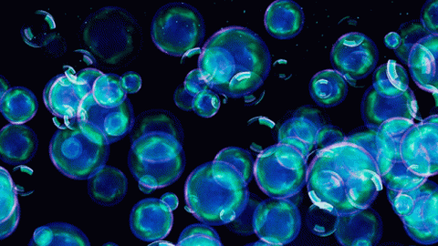
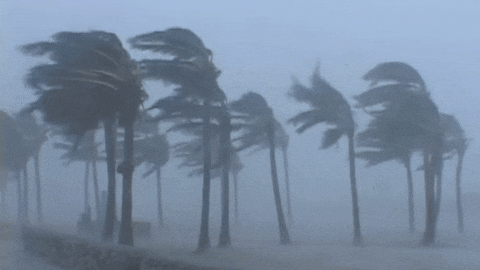

<h1>A Statistics-Driven Differentiable Approach for Sound Textures Synthesis and Analysis</h1>

  <a href="https://cordutie.github.io/"><strong>Esteban Gutiérrez</strong></a>1, 
  <a href="https://ffont.github.io/"><strong>Frederic Font</strong></a>1, 
  <strong>Xavier Serra1</strong>, and  
  <a href="https://lonce.org/"><strong>Lonce Wyse</strong></a>1

1 <em>Department of Information and Communications Technologies, Universitat Pompeu Fabra</em>

This webpage provides supplementary materials for our paper <em>"A Statistics-Driven Differentiable Approach for Sound Textures Synthesis and Analysis"</em>, currently under review for the 25th edition of the Digital Audio Effects (DAFx) Conference.

<h2><strong>1. Introduction</strong></h2>

In this work we introduce <code>TexStat</code>, a perceptually grounded loss function inspired by McDermott and Simoncelli’s work. Alongside it, we present <code>TexEnv</code>, a lightweight differentiable synthesizer, and <code>TexDSP</code>, a DDSP-style generative model tailored for texture audio. All tools are open-source, implemented in PyTorch, and designed for efficient training and evaluation. Below are a few highlighted examples generated with <code>TexDSP</code>.

  

  <!-- Header Row -->
  
<strong>Fire Model</strong>

  
<strong>Water Model</strong>

  
<strong>Wind Model</strong>

  <!-- Model Images Row -->
  

  

  

  <!-- First Sample Row -->
  

    <audio controls style="width: 100%;">
      <source src="./assets/audios/texdsp_resynthesis/fire_resynth.mp3" type="audio/mpeg" />
      Your browser does not support the audio element.
    </audio>
  

  

    <audio controls style="width: 100%;">
      <source src="./assets/audios/texdsp_resynthesis/bubbles_resynth.mp3" type="audio/mpeg" />
      Your browser does not support the audio element.
    </audio>
  

  

    <audio controls style="width: 100%;">
      <source src="./assets/audios/texdsp_resynthesis/wind_resynth.mp3" type="audio/mpeg" />
      Your browser does not support the audio element.
    </audio>
  

  <!-- Second Sample Row
  

    <audio controls style="width: 100%;">
      <source src="/assets/outputs/fire_1.mp3" type="audio/mpeg" />
      Your browser does not support the audio element.
    </audio>
  

  

    <audio controls style="width: 100%;">
      <source src="/assets/outputs/water_1.mp3" type="audio/mpeg" />
      Your browser does not support the audio element.
    </audio>
  

  

    <audio controls style="width: 100%;">
      <source src="/assets/outputs/rain_1.mp3" type="audio/mpeg" />
      Your browser does not support the audio element.
    </audio>
  

  

  

  

  <strong>Figure 1.</strong> Highlighted synthesized examples. 
  
   -->

<h2><strong>2. Models</strong></h2>
This work introduces three models that can be used for texture sounds analysis and synthesis. These model can work in conjunction but also as pieces of other models. A brief introduction for the three of them can be found here.

<h2>2.1. <code>TexStat</code> Loss</h2>

<code>TexStat</code> is a loss function based on a direct comparison of a revised version of McDermott and Simoncelli's summary of statistics <a href="https://doi.org/10.1016/j.neuron.2011.06.032" target="_blank" style="font-weight: normal;">[McDermott et al., 2020]</a>. This approach allows the TexStat loss function to train texture sound generative models by focusing strictly on the statistical properties of sounds, rather than the sounds themselves. As a result, the synthesized textures naturally differ from the original inputs, while still preserving the essential perceptual qualities that define their type.

  

  <strong>Figure 2.</strong> <code>TexStat</code>'s summary of statistics extraction diagram. 
  
  

<h2>2.2. TexEnv Synthesizer</h2>

<code>TexEnv</code> is a differentiable signal processor that through the use of the Inverse Discrete Fourier Transform creates a series of cyclic functions that are later imposed as amplitude envelopes of a subband decomposition of white noise. 

  

  <strong>Figure 3.</strong>  <code>TexEnv</code> synthesizer diagram. 
  
  

<h2>2.3. TexDSP architecture</h2>

<code>TexDSP</code> is an architecture based on Differential Digital Signal Processing (DDSP) <a href="https://magenta.tensorflow.org/ddsp" target="_blank" style="font-weight: normal;">[Engel et al., 2020]</a> introduced as a showcase of the previous models. At its core, <code>TexDSP</code> is a simple neural network whose goal is to learn a way to map simple features to the parameters needed by <code>TexEnv</code> to generate a particular texture sound by means of the <code>TexStat</code> loss function. This is done by finding statistical patterns between amplitude envelopes of a subband decomposition of the training data and then putting all together. A figure that summarizes this architecture can be found below.

  

    
  

  

  <strong>Figure 4.</strong> <code>TexDSP</code> architecture diagram. 
  
  

<h2><strong>3. Experiments</strong></h2>

Several experiments were conducted to validate the ideas and models proposed in this work. The details regarding all these experiments can be found here.

<h2>3.1. TexStat Properties</h2>

Two properties desirable in a loss function tailored for texture sounds are related to the stability under time shifting and addition of noise. In order to test these properties on the <code>TexStat</code> loss function, we compute the loss between a random selection of segments of sounds corresponding to the three categories of <a href="https://huggingface.co/datasets/cordutie/MicroTex" target="_blank" style="font-weight: normal;"><code>MicroTex</code></a> and their corresponding transformations using various parameters. The experiment was also run with the MSS loss for comparison and some of the results can be found in <strong>Tables 1 and 2</strong>. For further exploration see this article's webpage.

  <table style="width: 100%; border-collapse: collapse; font-size: 0.9em;">
    <thead style="background-color: #f2f2f2;">
      <tr>
        <th style="border: 1px solid #ccc; padding: 8px;">Selection</th>
        <th style="border: 1px solid #ccc; padding: 8px;">Loss</th>
        <th style="border: 1px solid #ccc; padding: 8px;">10%</th>
        <th style="border: 1px solid #ccc; padding: 8px;">30%</th>
        <th style="border: 1px solid #ccc; padding: 8px;">50%</th>
      </tr>
    </thead>
    <tbody>
      <tr><td>BOReilly</td><td><code>TexStat</code></td><td>0.12 ± 0.06</td><td>0.12 ± 0.06</td><td>0.12 ± 0.06</td></tr>
      <tr><td>BOReilly</td><td>MSS</td><td>5.34 ± 1.14</td><td>5.51 ± 1.29</td><td>5.58 ± 1.55</td></tr>
      <tr><td>Freesound</td><td><code>TexStat</code></td><td>0.04 ± 0.03</td><td>0.04 ± 0.03</td><td>0.04 ± 0.03</td></tr>
      <tr><td>Freesound</td><td>MSS</td><td>5.17 ± 1.24</td><td>5.26 ± 1.35</td><td>5.25 ± 1.34</td></tr>
      <tr><td>Syntex</td><td><code>TexStat</code></td><td>0.16 ± 0.11</td><td>0.16 ± 0.11</td><td>0.16 ± 0.11</td></tr>
      <tr><td>Syntex</td><td>MSS</td><td>10.52 ± 7.28</td><td>10.04 ± 6.62</td><td>9.45 ± 6.57</td></tr>
    </tbody>
  </table>
  

  <strong>Table 1.</strong> Time-Shift Robustness. Loss measurement between a sound and its time-shifted version. The amount of time shift is given in % of the total signal duration. Computed over 300 one-second sounds randomly sampled from the three main sources in the <code>MicroTex</code> dataset.
  
  

  <table style="width: 100%; border-collapse: collapse; font-size: 0.9em;">
    <thead style="background-color: #f2f2f2;">
      <tr>
        <th style="border: 1px solid #ccc; padding: 8px;">Selection</th>
        <th style="border: 1px solid #ccc; padding: 8px;">Loss</th>
        <th style="border: 1px solid #ccc; padding: 8px;">10%</th>
        <th style="border: 1px solid #ccc; padding: 8px;">30%</th>
        <th style="border: 1px solid #ccc; padding: 8px;">50%</th>
      </tr>
    </thead>
    <tbody>
      <tr><td>BOReilly</td><td><code>TexStat</code></td><td>0.12 ± 0.06</td><td>0.12 ± 0.06</td><td>0.12 ± 0.06</td></tr>
      <tr><td>BOReilly</td><td>MSS</td><td>5.34 ± 1.14</td><td>5.51 ± 1.29</td><td>5.58 ± 1.55</td></tr>
      <tr><td>Freesound</td><td><code>TexStat</code></td><td>0.04 ± 0.03</td><td>0.04 ± 0.03</td><td>0.04 ± 0.03</td></tr>
      <tr><td>Freesound</td><td>MSS</td><td>5.17 ± 1.24</td><td>5.26 ± 1.35</td><td>5.25 ± 1.34</td></tr>
      <tr><td>Syntex</td><td><code>TexStat</code></td><td>0.16 ± 0.11</td><td>0.16 ± 0.11</td><td>0.16 ± 0.11</td></tr>
      <tr><td>Syntex</td><td>MSS</td><td>10.52 ± 7.28</td><td>10.04 ± 6.62</td><td>9.45 ± 6.57</td></tr>
    </tbody>
  </table>
  

  <strong>Table 2.</strong> Noise-Addition Robustness. Loss measurement between a sound and its noisy version. The amount of noise added is given in % of the signal's energy. Same data sampling as in the previous experiment.
  
  

The results show that <code>TexStat</code> is highly stable with respect to both time shifting and noise addition, adding a penalty only in the category that had sounds that include silence (which generate instability since they have null standard deviance).

<h2>3.2. TexStat Benchmarks</h2>

To benchmark the computational requirements of <code>TexStat</code>, we evaluated its computation time, gradient descent time, and GPU memory usage. These measurements were conducted multiple times, recording the time taken for loss computation and optimization while tracking memory allocation. The results are presented in Table 3, along with the values for other typical losses.

<table style="width: 100%; border-collapse: collapse; font-size: 0.9em;">
  <thead style="background-color: #f2f2f2;">
    <tr>
      <th style="border: 1px solid #ccc; padding: 8px;">Loss</th>
      <th style="border: 1px solid #ccc; padding: 8px;">Forward pass time (ms)</th>
      <th style="border: 1px solid #ccc; padding: 8px;">Backward pass time (ms)</th>
      <th style="border: 1px solid #ccc; padding: 8px;">Memory usage (MB)</th>
    </tr>
  </thead>
  <tbody>
    <tr>
      <td><code>TexStat</code></td>
      <td>93.5 ± 0.4</td>
      <td>154.6 ± 0.4</td>
      <td>0.84 ± 2.5</td>
    </tr>
    <tr>
      <td>MSS</td>
      <td>3.9 ± 0.3</td>
      <td>8.5 ± 0.3</td>
      <td>0.85 ± 2.6</td>
    </tr>
    <tr>
      <td>MSE</td>
      <td>0.2 ± 0.3</td>
      <td>0.2 ± 0.1</td>
      <td>1.7 ± 5.0</td>
    </tr>
    <tr>
      <td>MAE</td>
      <td>0.1 ± 0.0</td>
      <td>0.2 ± 0.1</td>
      <td>0.8 ± 2.5</td>
    </tr>
  </tbody>
</table>

  <strong>Table 3.</strong> Measurements regarding computation time, gradient computation time, and memory usage in batches of 32 signals of size 65,536 (around 1.5s at a sample rate of 44,100 Hz). The losses studied were <code>TexStat</code>, Multi-Scale Spectrogram (MSS), Mean Squared Error (MSE), and Mean Absolute Error (MAE). All measurements were done using CUDA on an RTX 4090 GPU.

The results show that, as expected, the <code>TexStat</code> loss function is slower than other less specific losses, but it uses a similar amount of memory.

<h2>3.3. Summary Statistics as a Feature Vector</h2>

<h3 id="experiments-evaluation"><code>TexStat</code> as an Evaluation Metric</h3>

To test <code>TexStat</code> summary statistics as a powerful representation suitable for evaluation metrics like FAD, we conducted the following experiment. First, all data in the three selections of the <code>MicroTex</code> dataset were segmented, and both their summary statistics and VGGish embeddings <a href="#ref-vggish">[VGGish]</a> were computed. Then, a downstream classifier (MLP with hidden layers 128 and 64) was trained for each case. A summary of the results is presented in Table 4.

<table style="width: 100%; border-collapse: collapse; font-size: 0.9em;">
  <thead style="background-color: #f2f2f2;">
    <tr>
      <th style="border: 1px solid #ccc; padding: 8px;">Model</th>
      <th style="border: 1px solid #ccc; padding: 8px;">Selection</th>
      <th style="border: 1px solid #ccc; padding: 8px;">Accuracy</th>
      <th style="border: 1px solid #ccc; padding: 8px;">Precision</th>
      <th style="border: 1px solid #ccc; padding: 8px;">Recall</th>
      <th style="border: 1px solid #ccc; padding: 8px;">F1</th>
    </tr>
  </thead>
  <tbody>
    <tr><td><code>TexStat</code></td><td>BOReilly</td><td>0.94</td><td>0.94</td><td>0.94</td><td>0.94</td></tr>
    <tr><td>VGGish</td><td>BOReilly</td><td>0.71</td><td>0.73</td><td>0.71</td><td>0.71</td></tr>
    <tr><td><code>TexStat</code></td><td>Freesound</td><td>0.99</td><td>0.99</td><td>0.99</td><td>0.99</td></tr>
    <tr><td>VGGish</td><td>Freesound</td><td>0.98</td><td>0.99</td><td>0.98</td><td>0.98</td></tr>
    <tr><td><code>TexStat</code></td><td>Syntex</td><td>1.0</td><td>1.0</td><td>1.0</td><td>1.0</td></tr>
    <tr><td>VGGish</td><td>Syntex</td><td>0.95</td><td>0.95</td><td>0.95</td><td>0.94</td></tr>
  </tbody>
</table>

  <strong>Table 4.</strong> Lorea.

The results indicate that, in the context of texture sounds, <code>TexStat</code> summary statistics are strictly more informative than general-purpose embeddings like VGGish.

<h2>3.4. TexEnv Resynthesis</h2>

Extensive exploration using the <code>TexEnv</code> synthesizer in resynthesis tasks, employing a signal processing-based parameter extractor, was conducted to better understand its behavior and limitations. A summary of sound examples can be found on this article's page.

Some key findings:
<ul>
  <li>Water-like sounds (e.g., flowing water, rain, bubbling) benefited from <strong>larger filterbanks</strong> but not larger parameter sets.</li>
  <li>Crackling sounds (e.g., fireworks, bonfires) improved with <strong>larger parameter sets</strong> but were less sensitive to filterbank size.</li>
</ul>
These insights were used to determine the optimal parameters for model training.

<h2>3.5. TexDSP models</h2>

To demonstrate the capabilities of <code>TexStat</code>, we trained a series of <code>TexDSP</code> models using different parameters, with <code>TexStat</code> as the sole loss function. Below are the training details for these models.

<table style="width: 100%; border-collapse: collapse; font-size: 0.9em;">
  <thead style="background-color: #f2f2f2;">
    <tr>
      <th style="border: 1px solid #ccc; padding: 8px;">Texture</th>
      <th style="border: 1px solid #ccc; padding: 8px;">$N_F$</th>
      <th style="border: 1px solid #ccc; padding: 8px;">Enc/Dec Layers</th>
      <th style="border: 1px solid #ccc; padding: 8px;">Params per Band</th>
      <th style="border: 1px solid #ccc; padding: 8px;">Frame Size (s)</th>
    </tr>
  </thead>
  <tbody>
    <tr><td>Bubbles</td><td>24</td><td>3/3</td><td>512</td><td>1.49</td></tr>
    <tr><td>Fire</td><td>16</td><td>3/3</td><td>256</td><td>0.74</td></tr>
    <tr><td>Keyboard</td><td>24</td><td>3/3</td><td>256</td><td>1.49</td></tr>
    <tr><td>Rain</td><td>24</td><td>1/3</td><td>512</td><td>1.49</td></tr>
    <tr><td>River</td><td>24</td><td>1/3</td><td>128</td><td>0.74</td></tr>
    <tr><td>Shards</td><td>32</td><td>3/3</td><td>512</td><td>1.49</td></tr>
    <tr><td>Waterfall</td><td>24</td><td>1/3</td><td>256</td><td>1.49</td></tr>
    <tr><td>Wind</td><td>24</td><td>1/3</td><td>256</td><td>1.49</td></tr>
  </tbody>
</table>

  <strong>Table 5.</strong> Lorea.

All encoders and decoders used 256 neurons per layer. All models used <code>$N_G = 6$</code> and were trained for up to 1000 epochs with early stopping, targeting a 44.1kHz sample rate.

<h4>Validation Method</h4>

Validation was done by resynthesizing a hold-out portion of the dataset using both <code>TexStat</code> and MSS-trained models. We computed:
<ul>
  <li>FAD metrics with VGGish and <code>TexStat</code>-based embeddings</li>
  <li>Frame-by-frame <code>TexStat</code> and MSS losses (mean ± std)</li>
</ul>

<table style="width: 100%; border-collapse: collapse; font-size: 0.9em;">
  <thead style="background-color: #f2f2f2;">
    <tr>
      <th style="border: 1px solid #ccc; padding: 8px;">Texture</th>
      <th style="border: 1px solid #ccc; padding: 8px;">FAD (VGGish)</th>
      <th style="border: 1px solid #ccc; padding: 8px;">FAD (Ours)</th>
      <th style="border: 1px solid #ccc; padding: 8px;"><code>TexStat</code></th>
      <th style="border: 1px solid #ccc; padding: 8px;">MSS</th>
    </tr>
  </thead>
  <tbody>
    <tr><td>Bubbles</td><td>35.2</td><td>63.7</td><td>1.2 ± 0.3</td><td>7.9 ± 0.7</td></tr>
    <tr><td>Fire(1)</td><td>12.1</td><td>570.2</td><td>2.9 ± 2.0</td><td>10.1 ± 1.2</td></tr>
    <tr><td>Keyboard</td><td>13.0</td><td>1945.7</td><td>5.7 ± 2.0</td><td>9.1 ± 0.7</td></tr>
    <tr><td>Rain(2)</td><td>11.7</td><td>36.6</td><td>0.5 ± 0.2</td><td>9.5 ± 0.3</td></tr>
    <tr><td>River(2)</td><td>52.7</td><td>38.1</td><td>0.5 ± 0.1</td><td>7.7 ± 0.8</td></tr>
    <tr><td>Shards</td><td>4.6</td><td>8.1</td><td>1.0 ± 0.2</td><td>7.9 ± 0.2</td></tr>
    <tr><td>Waterfall(1)</td><td>18.2</td><td>28.4</td><td>0.3 ± 0.0</td><td>5.0 ± 0.0</td></tr>
    <tr><td>Wind(1)</td><td>9.7</td><td>244.7</td><td>0.8 ± 0.5</td><td>5.6 ± 0.1</td></tr>
  </tbody>
</table>

(1) Energy bands were imposed after resynthesis. (2) A loudness tracker was added post-resynthesis. For more comparisons, refer to NoiseBandNet <a href="#ref-noisebandnets">[ref]</a> and our webpage.

<h4>Discussion</h4>

These results highlight three main takeaways:
<ol>
  <li>Performance varied across textures, in line with findings by McDermott & Simoncelli and discussed in Subsection <code>Capabilities and Limitations</code>.</li>
  <li>Though our models performed adequately, reconstruction-focused models like NoiseBandNets scored higher—an expected trade-off since we focus on capturing higher-level structure, not perfect reconstruction.</li>
  <li>Our feature-derived metrics often aligned better with perceptual quality, although a proper subjective evaluation was beyond this paper's scope.</li>
</ol>

<h4>Additional Comments</h4>

One known application of DDSP is <strong>timbre transfer</strong> <a href="#ref-engel2020">[Engel et al., 2020]</a>, where pitch and loudness from one source (e.g., voice) drive a model trained on another timbre (e.g., violin), producing violin-like results. This works due to DDSP’s strong inductive bias.

In our models, similar effects are observed with textures. For example, a fire sound passed through a water-trained model yields water-like synthesis. But since pitch and loudness are less central in textures, transfer is less clear-cut. Spectral centroid and rate are not as distinctive as pitch in musical sounds. Nonetheless, examples of this phenomenon are available on our webpage.

Timbre Transfer

[see more](./timbre_transfer.html)

