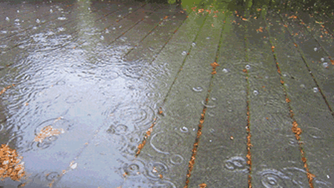

<h1>A Statistics-Driven Differentiable Approach for Sound Textures Synthesis and Analysis</h1>

  <a href="https://cordutie.github.io/"><strong>Esteban Gutiérrez</strong></a>1, 
  <a href="https://ffont.github.io/"><strong>Frederic Font</strong></a>1, 
  <strong>Xavier Serra</strong>, and  
  <a href="https://lonce.org/"><strong>Lonce Wyse</strong></a>1

1 <em>Department of Information and Communications Technologies, Universitat Pompeu Fabra</em>

This webpage provides supplementary materials for our paper <em>"A Statistics-Driven Differentiable Approach for Sound Textures Synthesis and Analysis"</em>, currently under review for the 25th edition of the Digital Audio Effects (DAFx) Conference.

<h2><strong>1. Introduction</strong></h2>

In this work we introduce <code>TexStat</code>, a perceptually grounded loss function inspired by McDermott and Simoncelli’s work. Alongside it, we present <code>TexEnv</code>, a lightweight differentiable synthesizer, and <code>TexDSP</code>, a DDSP-style generative model tailored for texture audio. All tools are open-source, implemented in PyTorch, and designed for efficient training and evaluation. Below are a few highlighted examples generated with <code>TexDSP</code>.

  

    <!-- Header row (Models and Sounds) -->
    
<strong>Model</strong>

    
<strong>Samples</strong>

  <!-- Fire Model Column -->
  

    
  

  

    <audio controls style="max-width: 300px;">
      <source src="/assets/outputs/water_to_water.mp3" type="audio/mpeg">
      Your browser does not support the audio element.
    </audio> 
    <audio controls style="max-width: 300px;">
      <source src="/assets/outputs/fire_to_water.mp3" type="audio/mpeg">
      Your browser does not support the audio element.
    </audio> 
    <audio controls style="max-width: 300px;">
      <source src="/assets/outputs/fire_to_wind.mp3" type="audio/mpeg">
      Your browser does not support the audio element.
    </audio>
  

  <!-- Water Model Column -->
  

    
  

  

    <audio controls style="max-width: 300px;">
      <source src="/assets/outputs/water_to_fire.mp3" type="audio/mpeg">
      Your browser does not support the audio element.
    </audio> 
    <audio controls style="max-width: 300px;">
      <source src="/assets/outputs/water_to_water.mp3" type="audio/mpeg">
      Your browser does not support the audio element.
    </audio> 
    <audio controls style="max-width: 300px;">
      <source src="/assets/outputs/water_to_wind.mp3" type="audio/mpeg">
      Your browser does not support the audio element.
    </audio>
  

  <!-- Wind Model Column -->
  

    
  

  

    <audio controls style="max-width: 300px;">
      <source src="/assets/outputs/wind_to_fire.mp3" type="audio/mpeg">
      Your browser does not support the audio element.
    </audio> 
    <audio controls style="max-width: 300px;">
      <source src="/assets/outputs/wind_to_water.mp3" type="audio/mpeg">
      Your browser does not support the audio element.
    </audio> 
    <audio controls style="max-width: 300px;">
      <source src="/assets/outputs/wind_to_wind.mp3" type="audio/mpeg">
      Your browser does not support the audio element.
    </audio>
  

  

<h2><strong>2. Models</strong></h2>

<h2>2.1. <code>TexStat</code> Loss</h2>

<code>TexStat</code> is a loss function based on a direct comparison of a revised version of <a href="https://doi.org/10.1016/j.neuron.2011.06.032" target="_blank" style="font-weight: normal;">McDermott and Simoncelli's summary of statistics</a>.  This approach allows the TexStat loss function to train texture sound generative models by focusing strictly on the statistical properties of sounds, rather than the sounds themselves. As a result, the synthesized textures naturally differ from the original inputs, while still preserving the essential perceptual qualities that define their type.

<h2>2.2. TexEnv Synthesizer</h2>

<h2>2.3. TexDSP architecture</h2>

<h2><strong>3. Experiments</strong></h2>

<h2>3.1. TexStat Properties</h2>

<h2>3.2. TexStat Benchmarks</h2>

<h2>3.3. Summary Statistics as a Feature Vector</h2>

<h2>3.4. TexEnv Resynthesis</h2>

<h2>3.5. TexDSP models</h2>