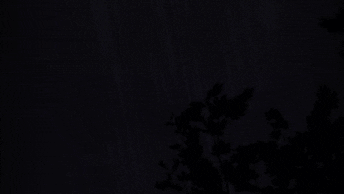

[back](./)

  <!-- Header Row -->
  
<strong>Original Texture (image)</strong>

  
<strong>Original Texture (sound)</strong>

  
<strong>Things to pay attention to</strong>

  

  

  

  

  

  

  

  

  <!-- Row: Bubbles -->
  

  
<audio controls src="./assets/audios/texdsp_resynthesis/bubbles.mp3"></audio>

  
Effervescence, popping rhythm

  
<audio controls src="./assets/audios/texdsp_timbre_transfer/bubbles_to_bubbles.mp3"></audio>

  
<audio controls src="./assets/audios/texdsp_timbre_transfer/bubbles_to_fire.mp3"></audio>

  
<audio controls src="./assets/audios/texdsp_timbre_transfer/bubbles_to_keyboard.mp3"></audio>

  
<audio controls src="./assets/audios/texdsp_timbre_transfer/bubbles_to_rain.mp3"></audio>

  
<audio controls src="./assets/audios/texdsp_timbre_transfer/bubbles_to_river.mp3"></audio>

  
<audio controls src="./assets/audios/texdsp_timbre_transfer/bubbles_to_shards.mp3"></audio>

  
<audio controls src="./assets/audios/texdsp_timbre_transfer/bubbles_to_waterfall.mp3"></audio>

  
<audio controls src="./assets/audios/texdsp_timbre_transfer/bubbles_to_wind.mp3"></audio>

  <!-- Row: Fire -->
  

  
<audio controls src="./assets/audios/texdsp_resynthesis/fire.mp3"></audio>

  
Crackling dynamics, hiss

  
<audio controls src="./assets/audios/texdsp_timbre_transfer/fire_to_bubbles.mp3"></audio>

  
<audio controls src="./assets/audios/texdsp_timbre_transfer/fire_to_fire.mp3"></audio>

  
<audio controls src="./assets/audios/texdsp_timbre_transfer/fire_to_keyboard.mp3"></audio>

  
<audio controls src="./assets/audios/texdsp_timbre_transfer/fire_to_rain.mp3"></audio>

  
<audio controls src="./assets/audios/texdsp_timbre_transfer/fire_to_river.mp3"></audio>

  
<audio controls src="./assets/audios/texdsp_timbre_transfer/fire_to_shards.mp3"></audio>

  
<audio controls src="./assets/audios/texdsp_timbre_transfer/fire_to_waterfall.mp3"></audio>

  
<audio controls src="./assets/audios/texdsp_timbre_transfer/fire_to_wind.mp3"></audio>

  <!-- Row: Keyboard -->
  

  
<audio controls src="./assets/audios/texdsp_resynthesis/keyboard.mp3"></audio>

  
Rhythmic tapping, mechanical textures

  
<audio controls src="./assets/audios/texdsp_timbre_transfer/keyboard_to_bubbles.mp3"></audio>

  
<audio controls src="./assets/audios/texdsp_timbre_transfer/keyboard_to_fire.mp3"></audio>

  
<audio controls src="./assets/audios/texdsp_timbre_transfer/keyboard_to_keyboard.mp3"></audio>

  
<audio controls src="./assets/audios/texdsp_timbre_transfer/keyboard_to_rain.mp3"></audio>

  
<audio controls src="./assets/audios/texdsp_timbre_transfer/keyboard_to_river.mp3"></audio>

  
<audio controls src="./assets/audios/texdsp_timbre_transfer/keyboard_to_shards.mp3"></audio>

  
<audio controls src="./assets/audios/texdsp_timbre_transfer/keyboard_to_waterfall.mp3"></audio>

  
<audio controls src="./assets/audios/texdsp_timbre_transfer/keyboard_to_wind.mp3"></audio>

  <!-- Row: Rain -->
  

  
<audio controls src="./assets/audios/texdsp_resynthesis/rain.mp3"></audio>

  
Continuous droplets, subtle variations

  
<audio controls src="./assets/audios/texdsp_timbre_transfer/rain_to_bubbles.mp3"></audio>

  
<audio controls src="./assets/audios/texdsp_timbre_transfer/rain_to_fire.mp3"></audio>

  
<audio controls src="./assets/audios/texdsp_timbre_transfer/rain_to_keyboard.mp3"></audio>

  
<audio controls src="./assets/audios/texdsp_timbre_transfer/rain_to_rain.mp3"></audio>

  
<audio controls src="./assets/audios/texdsp_timbre_transfer/rain_to_river.mp3"></audio>

  
<audio controls src="./assets/audios/texdsp_timbre_transfer/rain_to_shards.mp3"></audio>

  
<audio controls src="./assets/audios/texdsp_timbre_transfer/rain_to_waterfall.mp3"></audio>

  
<audio controls src="./assets/audios/texdsp_timbre_transfer/rain_to_wind.mp3"></audio>

  <!-- Row: River -->
  

  
<audio controls src="./assets/audios/texdsp_resynthesis/river.mp3"></audio>

  
Flowing motion, low-end texture

  
<audio controls src="./assets/audios/texdsp_timbre_transfer/river_to_bubbles.mp3"></audio>

  
<audio controls src="./assets/audios/texdsp_timbre_transfer/river_to_fire.mp3"></audio>

  
<audio controls src="./assets/audios/texdsp_timbre_transfer/river_to_keyboard.mp3"></audio>

  
<audio controls src="./assets/audios/texdsp_timbre_transfer/river_to_rain.mp3"></audio>

  
<audio controls src="./assets/audios/texdsp_timbre_transfer/river_to_river.mp3"></audio>

  
<audio controls src="./assets/audios/texdsp_timbre_transfer/river_to_shards.mp3"></audio>

  
<audio controls src="./assets/audios/texdsp_timbre_transfer/river_to_waterfall.mp3"></audio>

  
<audio controls src="./assets/audios/texdsp_timbre_transfer/river_to_wind.mp3"></audio>

  <!-- Row: Shards -->
  

  
<audio controls src="./assets/audios/texdsp_resynthesis/shards.mp3"></audio>

  
Sharp transients, glassy clinks

  
<audio controls src="./assets/audios/texdsp_timbre_transfer/shards_to_bubbles.mp3"></audio>

  
<audio controls src="./assets/audios/texdsp_timbre_transfer/shards_to_fire.mp3"></audio>

  
<audio controls src="./assets/audios/texdsp_timbre_transfer/shards_to_keyboard.mp3"></audio>

  
<audio controls src="./assets/audios/texdsp_timbre_transfer/shards_to_rain.mp3"></audio>

  
<audio controls src="./assets/audios/texdsp_timbre_transfer/shards_to_river.mp3"></audio>

  
<audio controls src="./assets/audios/texdsp_timbre_transfer/shards_to_shards.mp3"></audio>

  
<audio controls src="./assets/audios/texdsp_timbre_transfer/shards_to_waterfall.mp3"></audio>

  
<audio controls src="./assets/audios/texdsp_timbre_transfer/shards_to_wind.mp3"></audio>

  <!-- Row: Waterfall -->
  

  
<audio controls src="./assets/audios/texdsp_resynthesis/waterfall.mp3"></audio>

  
Dense water texture, downward motion

  
<audio controls src="./assets/audios/texdsp_timbre_transfer/waterfall_to_bubbles.mp3"></audio>

  
<audio controls src="./assets/audios/texdsp_timbre_transfer/waterfall_to_fire.mp3"></audio>

  
<audio controls src="./assets/audios/texdsp_timbre_transfer/waterfall_to_keyboard.mp3"></audio>

  
<audio controls src="./assets/audios/texdsp_timbre_transfer/waterfall_to_rain.mp3"></audio>

  
<audio controls src="./assets/audios/texdsp_timbre_transfer/waterfall_to_river.mp3"></audio>

  
<audio controls src="./assets/audios/texdsp_timbre_transfer/waterfall_to_shards.mp3"></audio>

  
<audio controls src="./assets/audios/texdsp_timbre_transfer/waterfall_to_waterfall.mp3"></audio>

  
<audio controls src="./assets/audios/texdsp_timbre_transfer/waterfall_to_wind.mp3"></audio>

  <!-- Row: Wind -->
  

  
<audio controls src="./assets/audios/texdsp_resynthesis/wind.mp3"></audio>

  
Swirling, airy textures

  
<audio controls src="./assets/audios/texdsp_timbre_transfer/wind_to_bubbles.mp3"></audio>

  
<audio controls src="./assets/audios/texdsp_timbre_transfer/wind_to_fire.mp3"></audio>

  
<audio controls src="./assets/audios/texdsp_timbre_transfer/wind_to_keyboard.mp3"></audio>

  
<audio controls src="./assets/audios/texdsp_timbre_transfer/wind_to_rain.mp3"></audio>

  
<audio controls src="./assets/audios/texdsp_timbre_transfer/wind_to_river.mp3"></audio>

  
<audio controls src="./assets/audios/texdsp_timbre_transfer/wind_to_shards.mp3"></audio>

  
<audio controls src="./assets/audios/texdsp_timbre_transfer/wind_to_waterfall.mp3"></audio>

  
<audio controls src="./assets/audios/texdsp_timbre_transfer/wind_to_wind.mp3"></audio>

