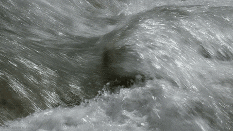

[back](./)

The table below presents 64 examples showcasing timbre transfer results using eight different <code>TexDSP</code> models applied to eight distinct texture sounds. Something interesting is that different models will deal differently with some details in the input. Some of this details are pointed out in the third column. 

  <!-- Full-width header row -->
  
<strong>Original Texture</strong>

  
<strong>Models</strong>

  <!-- Header Row -->
  
<strong>Image</strong>
 
  
<strong>Sound</strong>

  
<strong>Things to pay attention to:</strong>

  

  

  

  

  

  

  

  

  <!-- Row: Bubbles -->
  

  
<audio controls style="width: 180px;" src="./assets/audios/texdsp_resynthesis/bubbles_copy.mp3"></audio>

  
Pitch goes down in time

  
<audio controls style="width: 180px;" style="width: 180px;" src="./assets/audios/texdsp_timbre_transfer/bubbles_to_bubbles.mp3"></audio>

  
<audio controls style="width: 180px;" src="./assets/audios/texdsp_timbre_transfer/bubbles_to_fire.mp3"></audio>

  
<audio controls style="width: 180px;" src="./assets/audios/texdsp_timbre_transfer/bubbles_to_keyboard.mp3"></audio>

  
<audio controls style="width: 180px;" src="./assets/audios/texdsp_timbre_transfer/bubbles_to_rain.mp3"></audio>

  
<audio controls style="width: 180px;" src="./assets/audios/texdsp_timbre_transfer/bubbles_to_river.mp3"></audio>

  
<audio controls style="width: 180px;" src="./assets/audios/texdsp_timbre_transfer/bubbles_to_shards.mp3"></audio>

  
<audio controls style="width: 180px;" src="./assets/audios/texdsp_timbre_transfer/bubbles_to_waterfall.mp3"></audio>

  
<audio controls style="width: 180px;" src="./assets/audios/texdsp_timbre_transfer/bubbles_to_wind.mp3"></audio>

  <!-- Row: Fire -->
  

  
<audio controls style="width: 180px;" src="./assets/audios/texdsp_resynthesis/fire.mp3"></audio>

  
Crackling dynamics, hissing sound appear after some time

  
<audio controls style="width: 180px;" src="./assets/audios/texdsp_timbre_transfer/fire_to_bubbles.mp3"></audio>

  
<audio controls style="width: 180px;" src="./assets/audios/texdsp_timbre_transfer/fire_to_fire.mp3"></audio>

  
<audio controls style="width: 180px;" src="./assets/audios/texdsp_timbre_transfer/fire_to_keyboard.mp3"></audio>

  
<audio controls style="width: 180px;" src="./assets/audios/texdsp_timbre_transfer/fire_to_rain.mp3"></audio>

  
<audio controls style="width: 180px;" src="./assets/audios/texdsp_timbre_transfer/fire_to_river.mp3"></audio>

  
<audio controls style="width: 180px;" src="./assets/audios/texdsp_timbre_transfer/fire_to_shards.mp3"></audio>

  
<audio controls style="width: 180px;" src="./assets/audios/texdsp_timbre_transfer/fire_to_waterfall.mp3"></audio>

  
<audio controls style="width: 180px;" src="./assets/audios/texdsp_timbre_transfer/fire_to_wind.mp3"></audio>

  <!-- Row: Keyboard -->
  

  
<audio controls style="width: 180px;" src="./assets/audios/texdsp_resynthesis/keyboard.mp3"></audio>

  
Rhythmic patterns (hard to pick for <code>TexStat</code>)

  
<audio controls style="width: 180px;" src="./assets/audios/texdsp_timbre_transfer/keyboard_to_bubbles.mp3"></audio>

  
<audio controls style="width: 180px;" src="./assets/audios/texdsp_timbre_transfer/keyboard_to_fire.mp3"></audio>

  
<audio controls style="width: 180px;" src="./assets/audios/texdsp_timbre_transfer/keyboard_to_keyboard.mp3"></audio>

  
<audio controls style="width: 180px;" src="./assets/audios/texdsp_timbre_transfer/keyboard_to_rain.mp3"></audio>

  
<audio controls style="width: 180px;" src="./assets/audios/texdsp_timbre_transfer/keyboard_to_river.mp3"></audio>

  
<audio controls style="width: 180px;" src="./assets/audios/texdsp_timbre_transfer/keyboard_to_shards.mp3"></audio>

  
<audio controls style="width: 180px;" src="./assets/audios/texdsp_timbre_transfer/keyboard_to_waterfall.mp3"></audio>

  
<audio controls style="width: 180px;" src="./assets/audios/texdsp_timbre_transfer/keyboard_to_wind.mp3"></audio>

  <!-- Row: Rain -->
  

  
<audio controls style="width: 180px;" src="./assets/audios/texdsp_resynthesis/rain.mp3"></audio>

  
Occasional thunders in the background

  
<audio controls style="width: 180px;" src="./assets/audios/texdsp_timbre_transfer/rain_to_bubbles.mp3"></audio>

  
<audio controls style="width: 180px;" src="./assets/audios/texdsp_timbre_transfer/rain_to_fire.mp3"></audio>

  
<audio controls style="width: 180px;" src="./assets/audios/texdsp_timbre_transfer/rain_to_keyboard.mp3"></audio>

  
<audio controls style="width: 180px;" src="./assets/audios/texdsp_timbre_transfer/rain_to_rain.mp3"></audio>

  
<audio controls style="width: 180px;" src="./assets/audios/texdsp_timbre_transfer/rain_to_river.mp3"></audio>

  
<audio controls style="width: 180px;" src="./assets/audios/texdsp_timbre_transfer/rain_to_shards.mp3"></audio>

  
<audio controls style="width: 180px;" src="./assets/audios/texdsp_timbre_transfer/rain_to_waterfall.mp3"></audio>

  
<audio controls style="width: 180px;" src="./assets/audios/texdsp_timbre_transfer/rain_to_wind.mp3"></audio>

  <!-- Row: River -->
  

  
<audio controls style="width: 180px;" src="./assets/audios/texdsp_resynthesis/river.mp3"></audio>

  
Very loud and active flow

  
<audio controls style="width: 180px;" src="./assets/audios/texdsp_timbre_transfer/river_to_bubbles.mp3"></audio>

  
<audio controls style="width: 180px;" src="./assets/audios/texdsp_timbre_transfer/river_to_fire.mp3"></audio>

  
<audio controls style="width: 180px;" src="./assets/audios/texdsp_timbre_transfer/river_to_keyboard.mp3"></audio>

  
<audio controls style="width: 180px;" src="./assets/audios/texdsp_timbre_transfer/river_to_rain.mp3"></audio>

  
<audio controls style="width: 180px;" src="./assets/audios/texdsp_timbre_transfer/river_to_river.mp3"></audio>

  
<audio controls style="width: 180px;" src="./assets/audios/texdsp_timbre_transfer/river_to_shards.mp3"></audio>

  
<audio controls style="width: 180px;" src="./assets/audios/texdsp_timbre_transfer/river_to_waterfall.mp3"></audio>

  
<audio controls style="width: 180px;" src="./assets/audios/texdsp_timbre_transfer/river_to_wind.mp3"></audio>

  <!-- Row: Shards -->
  

  
<audio controls style="width: 180px;" src="./assets/audios/texdsp_resynthesis/shards.mp3"></audio>

  
Sharp transients from a series of very short pitched sounds (hard to pick for <code>TexStat</code>)

  
<audio controls style="width: 180px;" src="./assets/audios/texdsp_timbre_transfer/shards_to_bubbles.mp3"></audio>

  
<audio controls style="width: 180px;" src="./assets/audios/texdsp_timbre_transfer/shards_to_fire.mp3"></audio>

  
<audio controls style="width: 180px;" src="./assets/audios/texdsp_timbre_transfer/shards_to_keyboard.mp3"></audio>

  
<audio controls style="width: 180px;" src="./assets/audios/texdsp_timbre_transfer/shards_to_rain.mp3"></audio>

  
<audio controls style="width: 180px;" src="./assets/audios/texdsp_timbre_transfer/shards_to_river.mp3"></audio>

  
<audio controls style="width: 180px;" src="./assets/audios/texdsp_timbre_transfer/shards_to_shards.mp3"></audio>

  
<audio controls style="width: 180px;" src="./assets/audios/texdsp_timbre_transfer/shards_to_waterfall.mp3"></audio>

  
<audio controls style="width: 180px;" src="./assets/audios/texdsp_timbre_transfer/shards_to_wind.mp3"></audio>

  <!-- Row: Waterfall -->
  

  
<audio controls style="width: 180px;" src="./assets/audios/texdsp_resynthesis/waterfall.mp3"></audio>

  
Dense water texture

  
<audio controls style="width: 180px;" src="./assets/audios/texdsp_timbre_transfer/waterfall_to_bubbles.mp3"></audio>

  
<audio controls style="width: 180px;" src="./assets/audios/texdsp_timbre_transfer/waterfall_to_fire.mp3"></audio>

  
<audio controls style="width: 180px;" src="./assets/audios/texdsp_timbre_transfer/waterfall_to_keyboard.mp3"></audio>

  
<audio controls style="width: 180px;" src="./assets/audios/texdsp_timbre_transfer/waterfall_to_rain.mp3"></audio>

  
<audio controls style="width: 180px;" src="./assets/audios/texdsp_timbre_transfer/waterfall_to_river.mp3"></audio>

  
<audio controls style="width: 180px;" src="./assets/audios/texdsp_timbre_transfer/waterfall_to_shards.mp3"></audio>

  
<audio controls style="width: 180px;" src="./assets/audios/texdsp_timbre_transfer/waterfall_to_waterfall.mp3"></audio>

  
<audio controls style="width: 180px;" src="./assets/audios/texdsp_timbre_transfer/waterfall_to_wind.mp3"></audio>

  <!-- Row: Wind -->
  

  
<audio controls style="width: 180px;" src="./assets/audios/texdsp_resynthesis/wind.mp3"></audio>

  
Almost pitched but very noisy

  
<audio controls style="width: 180px;" src="./assets/audios/texdsp_timbre_transfer/wind_to_bubbles.mp3"></audio>

  
<audio controls style="width: 180px;" src="./assets/audios/texdsp_timbre_transfer/wind_to_fire.mp3"></audio>

  
<audio controls style="width: 180px;" src="./assets/audios/texdsp_timbre_transfer/wind_to_keyboard.mp3"></audio>

  
<audio controls style="width: 180px;" src="./assets/audios/texdsp_timbre_transfer/wind_to_rain.mp3"></audio>

  
<audio controls style="width: 180px;" src="./assets/audios/texdsp_timbre_transfer/wind_to_river.mp3"></audio>

  
<audio controls style="width: 180px;" src="./assets/audios/texdsp_timbre_transfer/wind_to_shards.mp3"></audio>

  
<audio controls style="width: 180px;" src="./assets/audios/texdsp_timbre_transfer/wind_to_waterfall.mp3"></audio>

  
<audio controls style="width: 180px;" src="./assets/audios/texdsp_timbre_transfer/wind_to_wind.mp3"></audio>

